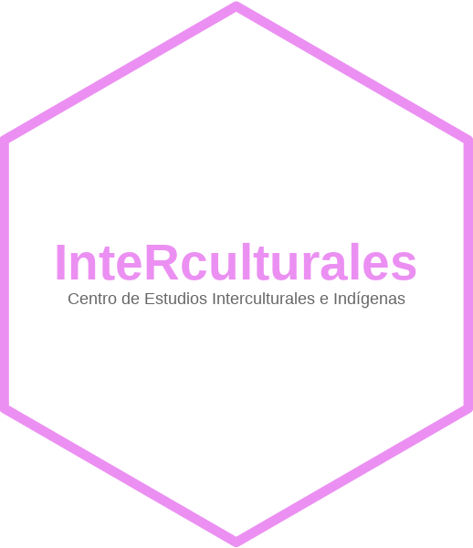

{width="586"}

# Seminario Cuantitativo

# ***InteRculturales:** Técnicas de ciencias sociales computacionales desde la relaciones interculturales.*

Público objetivo: Cualquier persona interesada en aprender o interiorizarse en habilidades cuantitativas de vangurdia.

**Inicio de curso: Jueves 8 de mayo 2025. Desde las 18:00**

El objetivo del Seminario es integrar las técnicas de Ciencias Sociales Computacionales a las relaciones interculturales. Este seminario busca: En primer lugar, entregar herramientas básicas para que sus asistentes pueden desenvolverse con éxito en trabajos que requieran habilidades cuantitativas. En segundo lugar, que se establezca una comunidad de práctica que reflexione y desafíe sobre las implicancias de las técnicas cuantitativas y la emergencia de la Inteligencia Artificial en nuestras (actuales o futuras) profesiones.

El curso se centrará en el trabajo con datos de encuestas, orientados a la gestión y comunicación de información; datos geográficos, que permitirán georreferenciar poblaciones e instituciones; e información textual, que abrirá posibilidades de análisis de contenidos. Finalmente, se explorarán técnicas emergentes de gestión de la información, como el Web Scraping y el uso de Inteligencia Artificial. Se utilizará el lenguaje de programación R y Python.

A lo largo del Seminario, los participantes aprenderán a aplicar metodologías innovadoras para procesar, analizar y comunicar resultados, integrando visualizaciones avanzada que resalten las interacciones entre diferentes grupos étnicos, los sesgos presentes en los datos y las complejidades de las relaciones interculturales en sus diversos contextos.

Inscripciones aquí: [Aquí](https://forms.cloud.microsoft/r/10cuEygf00)

# Temario del curso

| Sesión     | Contenido                                               | Presentación                                                                                          | Código práctico                                                                       | Paquetes / Tecnologías             | Referencias                                                                                |
|------------|------------|------------|------------|------------|------------|
| 08/05/2025 | Procesamiento de Datos en R con Tidyverse               | [Presentación 1](https://centrociir.github.io/interculturales/clases/clase1/pres/presentacion-1.html) | [Práctico 1](https://centrociir.github.io/interculturales/clases/clase1/clase_1.html) | `Tidyverse`                        | [Intro to R](https://intro2r.com)                                                          |
| 15/05/2025 | Visualización de Datos con ggplot2                      | [Presentación 2](https://matdknu.github.io/interculturales/clases/clase1/pres/presentacion-1.html)    | [Práctico 3](https://matdknu.github.io/cursoR-etnicidad/clases/clase3/clase3.html)    | `Ggplot2`, `Tidyverse`             | [R4DS: Visualización](https://r4ds.had.co.nz/data-visualisation.html)                      |
| 22/05/2025 | Reportes Automatizados en Quarto                        | [Presentación 3](https://matdknu.github.io/interculturales/clases/clase1/pres/presentacion-1.html)    | [Práctico 5](https://matdknu.github.io/cursoR-etnicidad/clases/clase5/clase5.html)    | `Quarto`, `Tidyverse`              | [Guía Quarto](https://quarto.org/docs/get-started/hello/rstudio.html)                      |
| 29/05/2025 | Análisis Geográficos de Mapas: Aplicación al CENSO 2017 | [Presentación 4](https://matdknu.github.io/interculturales/clases/clase1/pres/presentacion-1.html)    | [Práctico 4](https://matdknu.github.io/cursoR-etnicidad/clases/clase5/clase5.html)    | `ChileMapas`, `sf`, `Tidyverse`    | [ChileMapas](https://github.com/juanmiguelsr/chilemapas)                                   |
| 05/06/2025 | Análisis Cuantitativo de Texto en R                     | [Presentación 5](https://matdknu.github.io/interculturales/clases/clase5/presentacion-1.html)         | [Práctico 6](https://matdknu.github.io/cursoR-etnicidad/clases/clase6/clase6.html)    | `Quanteda`, `Tidyverse`            | [Text Mining with R](https://www.tidytextmining.com/)                                      |
| 12/06/2025 | Procesamiento de Datos en Python con Pandas             | [Presentación 6](https://matdknu.github.io/interculturales/clases/clase1/pres/presentacion-1.html)    | [Práctico 7](https://matdknu.github.io/cursoR-etnicidad/clases/clase7/clase7.html)    | `Pandas`                           | [Pandas Guide](https://pandas.pydata.org/docs/)                                            |
| 19/06/2025 | Uso de APIs en Python                                   | [Presentación 7](https://matdknu.github.io/interculturales/clases/clase1/pres/presentacion-1.html)    | [Práctico 8](https://matdknu.github.io/cursoR-etnicidad/clases/clase8/clase8.html)    | `requests`, `json`, `pandas`       | [OpenAI Docs](https://platform.openai.com/docs/)                                           |
| 26/06/2025 | Web Scraping                                            | [Presentación 8](https://matdknu.github.io/interculturales/clases/clase1/pres/presentacion-1.html)    | *Pronto*                                                                              | `rvest`, `BeautifulSoup`, `Scrapy` | [Web Scraping in R](https://rvest.tidyverse.org/), [Scrapy Docs](https://docs.scrapy.org/) |

{width="125"}

## Follow en GitHub...

Personas chilenas que tienen un contenido de R y Pyhon interesante:

-   [\@bastianolea](https://github.com/bastianolea)

-   [\@rivaquiroga](https://github.com/rivaquiroga/)

-   [\@pachadotdev](https://github.com/pachadotdev)

-   [\@robsalasco](https://github.com/robsalasco)

-   [\@mebucca](https://github.com/mebucca)

Personas a lo largo del mundo.

-   [\@juliasilge](https://github.com/)

-   [\@hadley](https://github.com/hadley)

-   [\@yihui](https://github.com/yihui)
