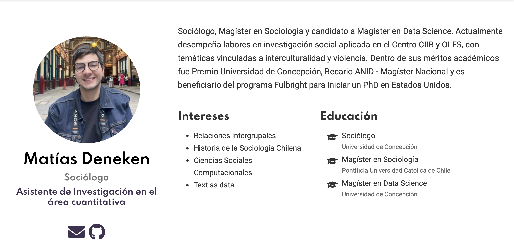
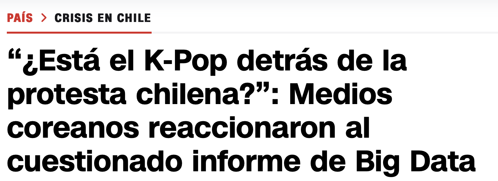
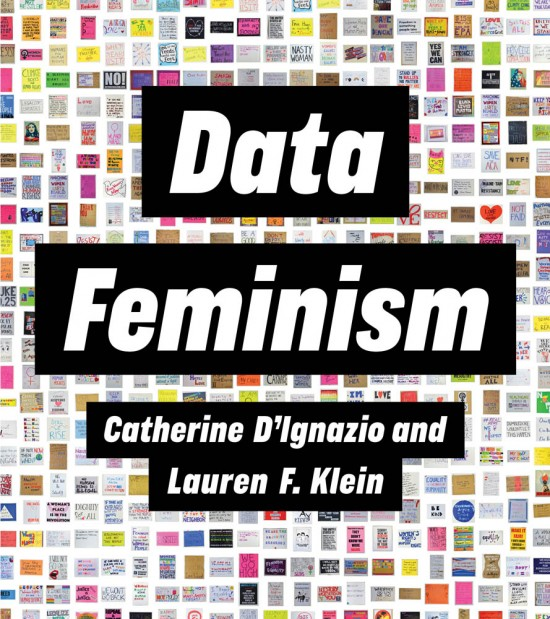
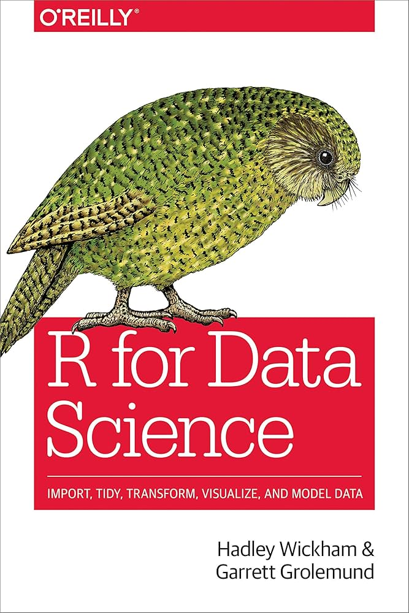
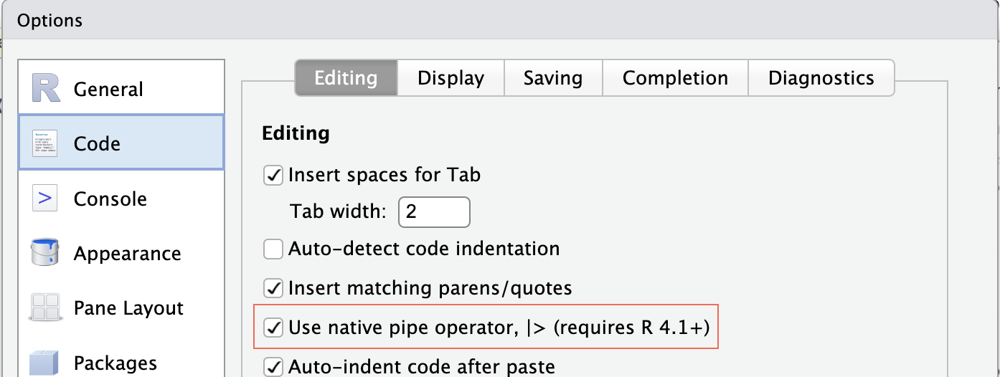
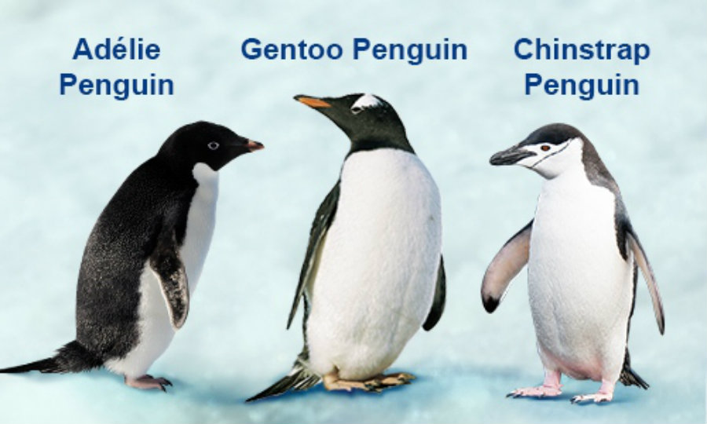
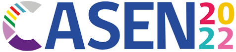

```{r setup, include=FALSE}
knitr::opts_chunk$set(
  warning = FALSE,
  message = FALSE,
  cache = FALSE
)

options(htmltools.dir.version = FALSE)

```


```{r xaringan-themer, include=FALSE}
library(xaringanthemer)
library(xaringanExtra)
library(palmerpenguins)
library(dplyr)
library(tidyverse)
use_panelset()


style_duo_accent(
  footnote_color = "#2c8475",
  footnote_position_bottom = "20px",
  footnote_font_size = "0.5em",
  primary_color = "#28282B",
  #primary_color = "#960606",
  secondary_color = "#2c8475",
  black_color = "#4242424",
  white_color = "#FFF",
  base_font_size = "25px",
  # text_font_family = "Jost",
  # text_font_url = "https://indestructibletype.com/fonts/Jost.css",
  header_font_google = google_font("Libre Franklin", "200", "400"),
  header_font_weight = "200",
    header_background_color = "#2c8475",
    header_background_text_color = "#2c8475",

  inverse_header_color = "#eaeaea",
  title_slide_text_color = "#FFFFFF",
  text_slide_number_color = "#9a9a9a",
  text_bold_color = "#960606",
  code_inline_color = "#B56B6F",
  code_highlight_color = "transparent",
  link_color = "#2c8475",
  table_row_even_background_color = lighten_color("#345865", 0.9),
  extra_fonts = list(
    "https://indestructibletype.com/fonts/Jost.css",
    google_font("Amatic SC", "400")
  ),
  colors = c(
    green = "#31b09e",
    "green-dark" = "#2c8475",
    highlight = "#87f9bb",
    purple = "#887ba3",
    pink = "#B56B6F",
    orange = "#f79334",
    red = "#dc322f",
    `blue-dark` = "#002b36",
    `text-dark` = "#202020",
    `text-darkish` = "#424242",
    `text-mild` = "#606060",
    `text-light` = "#9a9a9a",
    `text-lightest` = "#eaeaea"
  ),
  extra_css = list(
    ".remark-slide-content h3" = list(
      "margin-bottom" = 0, 
      "margin-top" = 0
    ),
    ".smallish, .smallish .remark-code-line" = list(`font-size` = "0.7em")
  )
)
xaringanExtra::use_xaringan_extra(c("tile_view", "animate_css", "tachyons", "share_again"))
xaringanExtra::use_extra_styles()

```

```{r metadata, echo=FALSE}
library(metathis)
meta() %>% 
  meta_description("InteRculturales, Pontificia Universidad Católica de Chile, Enero 10, 2025") %>% 
  meta_social(
    title = "InteRculturales",
    url = "",
    image = "",
    twitter_card_type = "summary_large_image",
    twitter_creator = "matdknu"
  )
```


```{r components, include=FALSE}
slides_from_images <- function(
  path,
  regexp = NULL,
  class = "hide-count",
  background_size = "contain",
  background_position = "top left"
) {
  if (isTRUE(getOption("slide_image_placeholder", FALSE))) {
    return(glue::glue("Slides to be generated from [{path}]({path})"))
  }
  if (fs::is_dir(path)) {
    imgs <- fs::dir_ls(path, regexp = regexp, type = "file", recurse = FALSE)
  } else if (all(fs::is_file(path) && fs::file_exists(path))) {
    imgs <- path
  } else {
    stop("path must be a directory or a vector of images")
  }
  imgs <- fs::path_rel(imgs, ".")
  breaks <- rep("\n---\n", length(imgs))
  breaks[length(breaks)] <- ""

  txt <- glue::glue("
  class: {class}
  background-image: url('{imgs}')
  background-size: {background_size}
  background-position: {background_position}
  {breaks}
  ")

  paste(txt, sep = "", collapse = "")
}
options("slide_image_placeholder" = FALSE)
```

class: left title-slide
background-image: url('images/pipa.jpg')
background-size: cover
background-position: left


[matdknu]: https://twitter.com/matdknu
[github]: https://matdknu.github.io


.side-text[
[&commat;matdknu][matdknu] | [matdknu.github.io][github]
]

.title-where[
### **InteRculturales <br> Introducción a técnicas de <br> ciencias sociales computacionales **
Centro de Estudios Interculturales e Indígenas <br>
Sesión 1 - 2025
]

```{css echo=FALSE}
.title-slide h1 {
  font-size: 80px;
  font-family: Jost, sans;
  color: #960606;  /* Cambio del color del texto a morado */
   position: absolute;
  top: 150px; /* Ajusta este valor para mover verticalmente */
  left: 50px; /* Ajusta este valor para mover horizontalmente */
}

.side-text {
  color: #960606;  /* Cambio del color del texto lateral a morado */
  transform: rotate(90deg);
  position: absolute;
  font-size: 22px;
  top: 150px;
  right: -130px;
}

.side-text a {
  color: #960606;  /* Cambio del color de los enlaces a morado */
}

.title-where {
  font-family: Jost, sans;
  font-size: 25px;
  position: absolute;
  bottom: 10px;
  color: #960606;  /* Cambio del color del texto de ubicación a morado */
}

/******************
 * 
 * Coloured content boxes
 *
 ****************/


.content-box { 
    box-sizing: content-box;
    	background-color: #e2e2e2;
  /* Total width: 160px + (2 * 20px) + (2 * 8px) = 216px
     Total height: 80px + (2 * 20px) + (2 * 8px) = 136px
     Content box width: 160px
     Content box height: 80px */
}

.content-box-primary,
.content-box-secondary,
.content-box-blue,
.content-box-gray,
.content-box-grey,
.content-box-army,
.content-box-green,
.content-box-purple,
.content-box-red,
.content-box-yellow {
    /*border-radius: 15px; */
    margin: 0 0 25px;
    overflow: hidden;
    padding: 20px;
    width: 100%;
}


.content-box-primary {
	background-color: var(--primary);

}


.content-box-secondary {
	background-color: var(--secondary);

}

.content-box-blue {
    background-color: #F0F8FF;

}

.content-box-gray {
    background-color: #e2e2e2;
}

.content-box-grey {
	background-color: #F5F5F5;
}

.content-box-army {
	background-color: #737a36;
}

.content-box-green {
	background-color: #d9edc2;
}

.content-box-purple {
	background-color: #e2e2f9;
}

.content-box-red {
	background-color: #f9dbdb;
}

.content-box-yellow {
	background-color: #fef5c4;
}


.full-width {
    display: flex;
    width: 100%;
    flex: 1 1 auto;
}

```


```{r logo, echo=FALSE}
library(xaringanExtra)
use_logo(
  image_url = "images/logo_ciir.jpg",
  exclude_class = c("title-slide","hide_logo","inverse"),
  width = "150px",
  height = "150px")
```


---

class: left middle

.full-width[.content-box-purple[
.bolder[]
Bienvenidos al taller metodológico!
Esperamos que este espacio sea nutritivo para su aprendizaje y que sea un lugar en el cuál podamos discutir sobre las implicancias del uso de técnicas computacionales para la investigación social. 

El taller se estructura en dos partes: Presentación, con una introducción a los conceptos fundamentales de la sesión,  y un código práctico en el cuál aplicaremos lo aprendido. 

]]


---

## Sobre mí


{width=250px}

---

## Ciencias Sociales Computacionales 

.pull-left[
📈 **Explosión de datos sociales digitales**
- Redes sociales, sensores, plataformas digitales  
- Nuevas fuentes de datos generadas en tiempo real

⚙️ **Avances tecnológicos**
- Aumento del poder computacional  
- Acceso a técnicas como machine learning y visualización avanzada

]

.pull-right[

🔍 **Limitaciones de los métodos tradicionales**

- Crece la necesidad de *escalar* el análisis sin perder profundidad teórica

🌐 **Transformación del mundo social**
- Lo digital ya no es un “medio”, sino parte del tejido social.  
- La vida social deja huellas de datos

]

---




---

## Ciencias Sociales Computacionales 

.pull-left[ **🔍 ¿Se puede ser crítico? **

¿Los datos son neutrales o reflejan relaciones de poder?
¿Qué queda fuera cuando modelamos o cuantificamos fenómenos sociales?

**🧠 Crítica en CSC implica:**

Cuestionar quién produce los datos y con qué fines
Reflexionar sobre los modelos, métricas y sesgos
Proponer formas más justas de representar la realidad ]

.pull-right[ **📌 Corrientes críticas**

✊ Feminismo de datos: ¿A quién se nombra, a quién se invisibiliza?
→ Data Feminism (D'Ignazio & Klein).

🌍 Decolonización de los datos:
→ ¿Qué epistemologías quedan fuera del análisis computacional?
→ Datos como forma de poder colonial.
 ]
 
---

## Ciencias Sociales Computacionales 

.pull-left[ 


 ]
 
 
.pull-right[

{width=150px}

]

---
## Introducción: R Base y Tidyverse

.pull-left[

**🧠 R Base **
Es el conjunto de funciones que vienen integradas por defecto en R. Permiten hacer casi todo (leer datos, analizarlos, graficarlos), pero con una sintaxis más técnica, menos legible y a veces más compleja para tareas comunes


**🌱 Tidyverse**

Es un ecosistema moderno de paquetes construidos sobre R base, diseñado para que trabajar con datos sea más intuitivo, legible y coherente.

]


.pull-right[

📌 En resumen

R base es el “idioma nativo” de R.
Tidyverse es una forma moderna y fluida de hablar ese idioma.


**Ejecución de funciones** 

```{r}
library(tidyverse) 
```

]

---

## Introducción: El Ecosistema Tidyverse

<div style="display: flex; justify-content: space-between; align-items: center;">

<div style="flex: 1; text-align: left;">
  <br>
  <small>Hadley Wickham</small>
</div>

<div style="flex: 1; text-align: center;">
  <br>
  <small>Tidyverse</small>
</div>

<div style="flex: 1; text-align: right;">
  <br>
  <small>R for Data Science</small>
</div>

</div>


---
## Esto no es una pipa!
.pull-left[
**¿Qué es la "pipa" en tidyverse?**
**La pipa `%>%`** permite *encadenar operaciones* de forma clara y legible.  

```{r}
penguins %>%
  group_by(species) %>%
  summarise(avg_bill_length = 
              mean(bill_length_mm, 
                na.rm = TRUE)) 
```
]

.pull-right[ 🎨 **¿Por qué se usa la imagen de Magritte para explicar la pipa?**

El operador %>% se pronuncia comúnmente como pipe (tubería en inglés), y su símbolo recuerda una tubería por donde fluye algo.

Juego conceptual: La obra de Magritte muestra una imagen de una pipa con el texto "Esto no es una pipa".

De modo similar, el operador %>% no es literalmente una pipa.

]

---

## Esto no es una pipa!

.pull-left[


]

.pull-right[


La pipa se ejecuta con `Command/Control + Shift + M `. 

**Dos formas**: Funcionan igual. 

- %>%
- |> 



]

---
 
### Tidyverse: Ejemplos con data Penguins



---

## Tidyverse: `select()` **Extrae columnas específicas del dataset**

```{r}
#| echo: false
penguin <- penguins |> select(species, island)
```

```{r}
penguin |> glimpse()
```

```{r}
penguin %>% 
  select(species) |> 
  head(5)
```

---

## Tidyverse: `mutate()` : **Crea nuevas columnas o transforma existentes**


```{r, message=FALSE}
penguins %>%
  mutate(bmi = body_mass_g / flipper_length_mm) |>  
  select(species, bmi, body_mass_g, flipper_length_mm) |> 
  head(2)
```

---

## Tidyverse: `mutate()` : **Crea nuevas columnas o transforma existentes**


```{r, message=FALSE}
# Clasificación condicional con case_when()
penguins %>%
  mutate(size_class = case_when(
    body_mass_g < 3000 ~ "liviano",
    body_mass_g < 4000 ~ "medio",
    TRUE ~ "pesado"
  )) |> select(species, size_class, body_mass_g) |> head(2)

```


---
## Tidyverse: `filter()`


```{r, results='hide'}
# Igualdad y conjunción (AND)
penguins %>%
  filter(species == "Adelie", island == "Biscoe")
```


```{r, results='hide'}
# Disyunción (OR)
penguins %>%
  filter(species == "Adelie" | species == "Gentoo")
```

---

## Tidyverse: `filter()`  

```{r, results='hide'}
# Negación
penguins %>%
  filter(species != "Chinstrap")

# Pertenencia múltiple
penguins %>%
  filter(species %in% c("Adelie", "Gentoo"))

# Filtrar valores faltantes
penguins %>%
  filter(is.na(sex))

```

---

## Tidyverse: `group_by()` + `summarise()`


```{r}
penguins %>%
  group_by(species) %>%
  summarise(
    promedio_masa = mean(body_mass_g, na.rm = TRUE),
    mediana_masa = median(body_mass_g, na.rm = TRUE),
    conteo = n()
  )
```


---

## Aplicación de datos



 

```{r}
casen2022 <- readRDS("data/casen2022_sample.rds") |> glimpse()
```


---

## Aplicación de datos


---

## Comunicación de resultados


---

## Comunicación de resultados

---

class: middle right
background-image: url('d-koi-GQJY4UPR21U-unsplash.jpg')
background-size: cover

# **Muchas Gracias**
### **Vamos al código!** 


