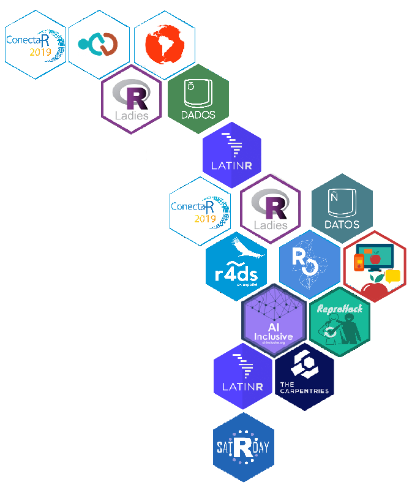

```{r setup, include=FALSE}
knitr::opts_chunk$set(
  warning = FALSE,
  message = FALSE,
  cache = FALSE
)

options(htmltools.dir.version = FALSE)
```


```{r xaringan-themer, include=FALSE}
library(xaringanthemer)
library(xaringanExtra)
library(palmerpenguins)
library(dplyr)
library(tidyverse)
library(readr)
use_panelset()


style_duo_accent(
  footnote_color = "#2c8475",
  footnote_position_bottom = "20px",
  footnote_font_size = "0.5em",
  primary_color = "#28282B",
  #primary_color = "#960606",
  secondary_color = "#2c8475",
  black_color = "#4242424",
  white_color = "#FFF",
  base_font_size = "25px",
  # text_font_family = "Jost",
  # text_font_url = "https://indestructibletype.com/fonts/Jost.css",
  header_font_google = google_font("Libre Franklin", "200", "400"),
  header_font_weight = "200",
    header_background_color = "#2c8475",
    header_background_text_color = "#2c8475",

  inverse_header_color = "#eaeaea",
  title_slide_text_color = "#FFFFFF",
  text_slide_number_color = "#9a9a9a",
  text_bold_color = "#960606",
  code_inline_color = "#B56B6F",
  code_highlight_color = "transparent",
  link_color = "#2c8475",
  table_row_even_background_color = lighten_color("#345865", 0.9),
  extra_fonts = list(
    "https://indestructibletype.com/fonts/Jost.css",
    google_font("Amatic SC", "400")
  ),
  colors = c(
    green = "#31b09e",
    "green-dark" = "#2c8475",
    highlight = "#87f9bb",
    purple = "#887ba3",
    pink = "#B56B6F",
    orange = "#f79334",
    red = "#dc322f",
    `blue-dark` = "#002b36",
    `text-dark` = "#202020",
    `text-darkish` = "#424242",
    `text-mild` = "#606060",
    `text-light` = "#9a9a9a",
    `text-lightest` = "#eaeaea"
  ),
  extra_css = list(
    ".remark-slide-content h3" = list(
      "margin-bottom" = 0, 
      "margin-top" = 0
    ),
    ".smallish, .smallish .remark-code-line" = list(`font-size` = "0.7em")
  )
)
xaringanExtra::use_xaringan_extra(c("tile_view", "animate_css", "tachyons", "share_again"))
xaringanExtra::use_extra_styles()

```

```{r metadata, echo=FALSE}
library(metathis)
meta() %>% 
  meta_description("InteRculturales, Pontificia Universidad Católica de Chile, Enero 10, 2025") %>% 
  meta_social(
    title = "InteRculturales",
    url = "",
    image = "",
    twitter_card_type = "summary_large_image",
    twitter_creator = "matdknu"
  )
```


```{r components, include=FALSE}
slides_from_images <- function(
  path,
  regexp = NULL,
  class = "hide-count",
  background_size = "contain",
  background_position = "top left"
) {
  if (isTRUE(getOption("slide_image_placeholder", FALSE))) {
    return(glue::glue("Slides to be generated from [{path}]({path})"))
  }
  if (fs::is_dir(path)) {
    imgs <- fs::dir_ls(path, regexp = regexp, type = "file", recurse = FALSE)
  } else if (all(fs::is_file(path) && fs::file_exists(path))) {
    imgs <- path
  } else {
    stop("path must be a directory or a vector of images")
  }
  imgs <- fs::path_rel(imgs, ".")
  breaks <- rep("\n---\n", length(imgs))
  breaks[length(breaks)] <- ""

  txt <- glue::glue("
  class: {class}
  background-image: url('{imgs}')
  background-size: {background_size}
  background-position: {background_position}
  {breaks}
  ")

  paste(txt, sep = "", collapse = "")
}
options("slide_image_placeholder" = FALSE)
```

class: left title-slide
background-image: url('images/pipa.jpg')
background-size: cover
background-position: left


[matdknu]: https://twitter.com/matdknu
[github]: https://matdknu.github.io


.side-text[
[&commat;matdknu][matdknu] | [matdknu.github.io][github]
]

.title-where[
### **InteRculturales <br> Introducción a técnicas de <br> ciencias sociales computacionales **
Centro de Estudios Interculturales e Indígenas <br>
Sesión 1 - 2025
]

```{css echo=FALSE}
.title-slide h1 {
  font-size: 80px;
  font-family: Jost, sans;
  color: #960606;  /* Cambio del color del texto a morado */
   position: absolute;
  top: 150px; /* Ajusta este valor para mover verticalmente */
  left: 50px; /* Ajusta este valor para mover horizontalmente */
}

.side-text {
  color: #960606;  /* Cambio del color del texto lateral a morado */
  transform: rotate(90deg);
  position: absolute;
  font-size: 22px;
  top: 150px;
  right: -130px;
}

.side-text a {
  color: #960606;  /* Cambio del color de los enlaces a morado */
}

.title-where {
  font-family: Jost, sans;
  font-size: 25px;
  position: absolute;
  bottom: 10px;
  color: #960606;  /* Cambio del color del texto de ubicación a morado */
}

/******************
 * 
 * Coloured content boxes
 *
 ****************/


.content-box { 
    box-sizing: content-box;
    	background-color: #e2e2e2;
  /* Total width: 160px + (2 * 20px) + (2 * 8px) = 216px
     Total height: 80px + (2 * 20px) + (2 * 8px) = 136px
     Content box width: 160px
     Content box height: 80px */
}

.content-box-primary,
.content-box-secondary,
.content-box-blue,
.content-box-gray,
.content-box-grey,
.content-box-army,
.content-box-green,
.content-box-purple,
.content-box-red,
.content-box-yellow {
    /*border-radius: 15px; */
    margin: 0 0 25px;
    overflow: hidden;
    padding: 20px;
    width: 100%;
}


.content-box-primary {
	background-color: var(--primary);

}


.content-box-secondary {
	background-color: var(--secondary);

}

.content-box-blue {
    background-color: #F0F8FF;

}

.content-box-gray {
    background-color: #e2e2e2;
}

.content-box-grey {
	background-color: #F5F5F5;
}

.content-box-army {
	background-color: #737a36;
}

.content-box-green {
	background-color: #d9edc2;
}

.content-box-purple {
	background-color: #e2e2f9;
}

.content-box-red {
	background-color: #f9dbdb;
}

.content-box-yellow {
	background-color: #fef5c4;
}


.full-width {
    display: flex;
    width: 100%;
    flex: 1 1 auto;
}

```


```{r logo, echo=FALSE}
library(xaringanExtra)
use_logo(
  image_url = "images/logo_ciir.jpg",
  exclude_class = c("title-slide","hide_logo","inverse"),
  width = "150px",
  height = "150px")
```


---

## **Bienvenidos al taller metodológico!**


.full-width[.content-box-purple[
.bolder[]
Esperamos que este espacio sea nutritivo para su aprendizaje y que sea un lugar en el cuál podamos discutir sobre las implicancias del uso de técnicas computacionales para la investigación social. 

El taller se estructura en dos partes: Presentación, con una introducción a los conceptos fundamentales de la sesión,  y un código práctico en el cuál aplicaremos lo aprendido. 

]]


---

## **Sobre mí**


{width=250px}

---

## **Temario de hoy**

1. ¿Qué son las ciencias sociales computacionales? 
2. Introducción a Tidyverse
3. Funciones fundamentales de Tidyverse
4. Aplicación a datos reales
5. Comunicación de resultados
6. Código práctico

---


---

## **Ciencias Sociales Computacionales** 

.pull-left[
📈 **Explosión de datos sociales digitales**
- Redes sociales, sensores, plataformas digitales  
- Nuevas fuentes de datos generadas en tiempo real

⚙️ **Avances tecnológicos**
- Aumento del poder computacional  
- Acceso a técnicas como machine learning y visualización avanzada

]

.pull-right[

🔍 **Limitaciones de los métodos tradicionales**

- Crece la necesidad de *escalar* el análisis sin perder profundidad teórica

🌐 **Transformación del mundo social**
- Lo digital ya no es un “medio”, sino parte del tejido social.  
- La vida social deja huellas de datos

]

---


---

## **Ciencias Sociales Computacionales**

.pull-left[ **🔍 ¿Se puede ser crítico? **

¿Los datos son neutrales o reflejan relaciones de poder?
¿Qué queda fuera cuando modelamos o cuantificamos fenómenos sociales?

**🧠 Crítica en CSC implica:**

Cuestionar quién produce los datos y con qué fines
Reflexionar sobre los modelos, métricas y sesgos
Proponer formas más justas de representar la realidad ]

.pull-right[ **📌 Corrientes críticas**

✊ Feminismo de datos: ¿A quién se nombra, a quién se invisibiliza?
→ Data Feminism (D'Ignazio & Klein).

🌍 Decolonización de los datos:
→ ¿Qué epistemologías quedan fuera del análisis computacional?
→ Datos como forma de poder colonial.
 ]
 
---


## **Ciencias Sociales Computacionales **

.pull-left[ 


 ]
 
 
.pull-right[

{width=150px}

]

---
## **Introducción: R Base y Tidyverse**

.pull-left[

**🧠 R Base **
Es el conjunto de funciones que vienen integradas por defecto en R. Permiten hacer casi todo (leer datos, analizarlos, graficarlos), pero con una sintaxis más técnica, menos legible y a veces más compleja para tareas comunes


**🌱 Tidyverse**

Es un ecosistema moderno de paquetes construidos sobre R base, diseñado para que trabajar con datos sea más intuitivo, legible y coherente.

]


.pull-right[

📌 En resumen

R base es el “idioma nativo” de R.
Tidyverse es una forma moderna y fluida de hablar ese idioma.


**Ejecución de funciones** 

```{r}
library(tidyverse) 
```

]

---
## ** Sobre R**
.pull-left[
Al trabajar en R, realizamos nuestros análisis y pruebas mediante scripts. Los scripts son archivos de texto que terminan en .R. En estos archivos de texto escribimos nuestro código.

La consola es la forma directa de interactuar con el lenguaje R. En ella, las instrucciones se escriben y se presiona enter para enviar los comandos.

Si escribimos nuestros comandos en scripts, los comandos van a quedar guardados. Si una línea contiene un signo gato #, todo lo que esté después del gato se transformará un comentario
]

.pull-right[


]

---

## ** Sobre R**

.pull-left[ 

R es un lenguaje de programación diseñado especialmente para el análisis de datos, la estadística y la visualización. Con R puedes realizar desde operaciones matemáticas básicas, como si fuera una calculadora, hasta tareas mucho más complejas como definir funciones propias, manipular grandes bases de datos, crear gráficos personalizados, aplicar modelos estadísticos, realizar análisis de texto.

Gracias a su comunidad, R cuenta con miles de paquetes que permiten extender sus funcionalidades en áreas como machine learning y análisis espacial.

]

<div style="float: right; width: 30%;">
  
</div>


---

## **Introducción: El Ecosistema Tidyverse **

<div style="display: flex; justify-content: space-between; align-items: center;">

<div style="flex: 1; text-align: left;">
  <br>
  <small>Hadley Wickham</small>
</div>

<div style="flex: 1; text-align: center;">
  <br>
  <small>Tidyverse</small>
</div>

<div style="flex: 1; text-align: right;">
  <br>
  <small>R for Data Science</small>
</div>

</div>


---
## **Esto no es una pipa! **

.pull-left[
**¿Qué es la "pipa" en tidyverse?**
**La pipa `%>%`** permite *encadenar operaciones* de forma clara y legible.  

```{r}
penguins %>%
  group_by(species) %>%
  summarise(avg_bill_length = 
              mean(bill_length_mm, 
                na.rm = TRUE)) 
```
]

.pull-right[ 🎨 **¿Por qué se usa la imagen de Magritte para explicar la pipa?**

El operador %>% se pronuncia comúnmente como pipe (tubería en inglés), y su símbolo recuerda una tubería por donde fluye algo.

Juego conceptual: La obra de Magritte muestra una imagen de una pipa con el texto "Esto no es una pipa".

De modo similar, el operador %>% no es literalmente una pipa.

]

---

## **Esto no es una pipa!**

.pull-left[


]

.pull-right[


La pipa se ejecuta con `Command/Control + Shift + M `. 

**Dos formas**: Funcionan igual. 

- %>%
- |> 


]

---
 
### **Tidyverse: Ejemplos con data Penguins**


---
## **Funciones del R Base**

R es un software basado en objetos. Un objeto es una estructura que almacena información en la memoria.

```{r}
pepino <- 7
manzana <- 4

pepino * manzana #mutiplicación
```
```{r}
pepino/manzana #división
```

---

## **Funciones del R Base**


```{r}
# Crear vector de frutas (caracteres)
frutas <- c("Manzana", "Banana", "Pera", "Naranja", "Uva")
# Crear vector con longitudes en centímetros (números)
longitud_cm <- c(8.5, 20.0, 10.0, 9.0, 2.5)

# Combinar en una tabla usando data.frame
tabla_frutas <- data.frame(
  Fruta = frutas,
  Longitud_cm = longitud_cm
)

# Ver tabla
print(tabla_frutas)

```


---

## **Funciones del R Base**

```{r}
summary(penguins)
```


---
## Tidyverse: `select()` **Extrae columnas específicas del dataset**

```{r}
#| echo: false
penguin <- penguins |> select(species, island)
```

```{r}
penguin |> glimpse()
```

```{r}
penguin %>% 
  select(species) |> 
  head(5)
```

---

## Tidyverse: `mutate()` : **Crea nuevas columnas o transforma existentes**


```{r, message=FALSE}
penguins %>%
  mutate(bmi = body_mass_g / flipper_length_mm) |>  
  select(species, bmi, body_mass_g, flipper_length_mm) |> 
  head(2)
```

---

## Tidyverse: `mutate()` : **Crea nuevas columnas o transforma existentes**


```{r, message=FALSE}
# Clasificación condicional con case_when()
penguins %>%
  mutate(size_class = case_when(
    body_mass_g < 3000 ~ "liviano",
    body_mass_g < 4000 ~ "medio",
    TRUE ~ "pesado"
  )) |> select(species, size_class, body_mass_g) |> head(2)

```


---
## **Tidyverse: `filter()`**


```{r, results='hide'}
# Igualdad y conjunción (AND)
penguins %>%
  filter(species == "Adelie", # Esta especia
         island == "Biscoe")  #Esta lista
```


```{r, results='hide'}
# Disyunción (OR)
penguins %>%
  filter(species == "Adelie" | species == "Gentoo") #Cualquiera de ambas
```

---

## **Tidyverse: `filter()`  **

```{r, results='hide'}
# Negación
penguins %>%
  filter(species != "Chinstrap") # Esa no

# Pertenencia múltiple
penguins %>%
  filter(species %in% c("Adelie", "Gentoo")) #Cualquiera de las dods

# Filtrar valores faltantes
penguins %>%
  filter(!is.na(island)) # No NA

```

---

## **Tidyverse: `group_by()` + `summarise()`**


```{r}
penguins %>%
  group_by(species) %>%
  summarise(
    promedio_masa = mean(body_mass_g, na.rm = TRUE),
    mediana_masa = median(body_mass_g, na.rm = TRUE),
    conteo = n()
  )
```


---

## **Aplicación de datos**


 

```{r}
casen2022 <- readRDS("data/casen2022_sample.rds") |> glimpse()
```


---

## **Aplicación de datos**


```{r}
casen2022 |> select(pueblos_indigenas, yautcor, region, educ) |> 
  group_by(pueblos_indigenas) |> # Indígena (0 = No, 1 = Sí)
  summarise(
    promedio_ingreso = mean(yautcor, na.rm = TRUE))
```

---

## **Comunicación de resultados: R orientado a objetos **

```{r}
tabla <- casen2022 |> select(pueblos_indigenas, yautcor, region, educ) |> 
  group_by(pueblos_indigenas) |> # Indígena (0 = No, 1 = Sí)
  summarise(
    promedio_ingreso = mean(yautcor, na.rm = TRUE))
```

```{r}
tabla
```


---

## **Comunicación de resultados**

```{r}
readr::write_csv(tabla, "table/tabla.csv") #Guardar en carpeta table
```


---

class: middle right
background-image: url('d-koi-GQJY4UPR21U-unsplash.jpg')
background-size: cover

# **Muchas Gracias**
### **Vamos al código!** 


