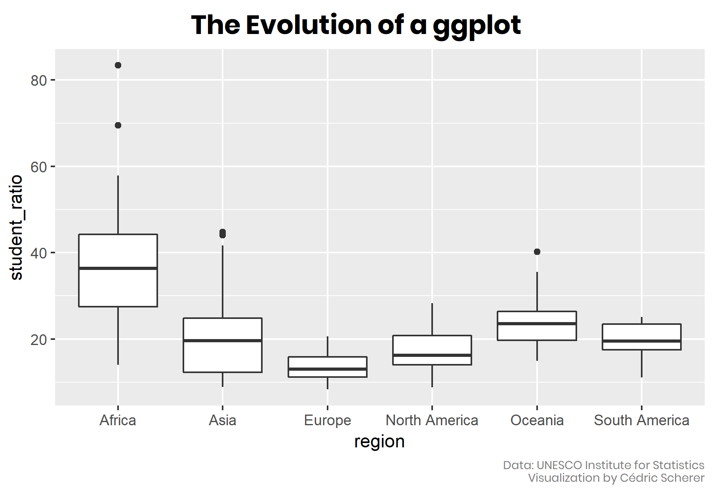
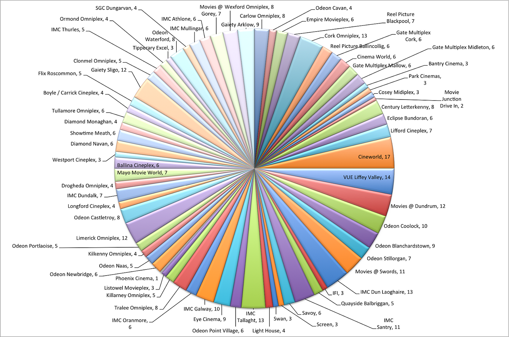
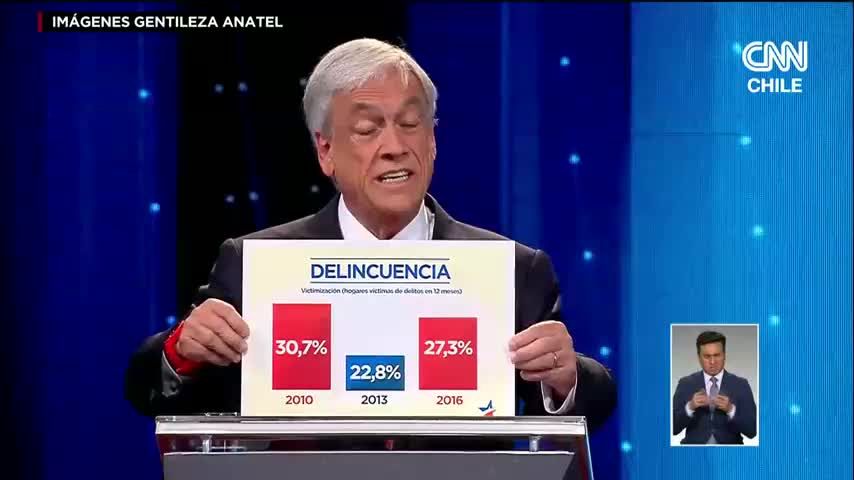

```{r setup, include=FALSE}
knitr::opts_chunk$set(
  warning = FALSE,
  message = FALSE,
  cache = FALSE
)

options(htmltools.dir.version = FALSE)
```


```{r xaringan-themer, include=FALSE}
library(xaringanthemer)
library(xaringanExtra)
library(palmerpenguins)
library(dplyr)
library(tidyverse)
library(readr)
use_panelset()


style_duo_accent(
  footnote_color = "#2c8475",
  footnote_position_bottom = "20px",
  footnote_font_size = "0.5em",
  primary_color = "#28282B",
  #primary_color = "#960606",
  secondary_color = "#2c8475",
  black_color = "#4242424",
  white_color = "#FFF",
  base_font_size = "25px",
  # text_font_family = "Jost",
  # text_font_url = "https://indestructibletype.com/fonts/Jost.css",
  header_font_google = google_font("Libre Franklin", "200", "400"),
  header_font_weight = "200",
    header_background_color = "#2c8475",
    header_background_text_color = "#2c8475",

  inverse_header_color = "#eaeaea",
  title_slide_text_color = "#FFFFFF",
  text_slide_number_color = "#9a9a9a",
  text_bold_color = "#960606",
  code_inline_color = "#B56B6F",
  code_highlight_color = "transparent",
  link_color = "#2c8475",
  table_row_even_background_color = lighten_color("#345865", 0.9),
  extra_fonts = list(
    "https://indestructibletype.com/fonts/Jost.css",
    google_font("Amatic SC", "400")
  ),
  colors = c(
    green = "#31b09e",
    "green-dark" = "#2c8475",
    highlight = "#87f9bb",
    purple = "#887ba3",
    pink = "#B56B6F",
    orange = "#f79334",
    red = "#dc322f",
    `blue-dark` = "#002b36",
    `text-dark` = "#202020",
    `text-darkish` = "#424242",
    `text-mild` = "#606060",
    `text-light` = "#9a9a9a",
    `text-lightest` = "#eaeaea"
  ),
  extra_css = list(
    ".remark-slide-content h3" = list(
      "margin-bottom" = 0, 
      "margin-top" = 0
    ),
    ".smallish, .smallish .remark-code-line" = list(`font-size` = "0.7em")
  )
)
xaringanExtra::use_xaringan_extra(c("tile_view", "animate_css", "tachyons", "share_again"))
xaringanExtra::use_extra_styles()

```

```{r metadata, echo=FALSE}
library(metathis)
meta() %>% 
  meta_description("InteRculturales, Pontificia Universidad Católica de Chile, 2025") %>% 
  meta_social(
    title = "InteRculturales",
    url = "",
    image = "",
    twitter_card_type = "summary_large_image",
    twitter_creator = "matdknu"
  )
```


```{r components, include=FALSE}
slides_from_images <- function(
  path,
  regexp = NULL,
  class = "hide-count",
  background_size = "contain",
  background_position = "top left"
) {
  if (isTRUE(getOption("slide_image_placeholder", FALSE))) {
    return(glue::glue("Slides to be generated from [{path}]({path})"))
  }
  if (fs::is_dir(path)) {
    imgs <- fs::dir_ls(path, regexp = regexp, type = "file", recurse = FALSE)
  } else if (all(fs::is_file(path) && fs::file_exists(path))) {
    imgs <- path
  } else {
    stop("path must be a directory or a vector of images")
  }
  imgs <- fs::path_rel(imgs, ".")
  breaks <- rep("\n---\n", length(imgs))
  breaks[length(breaks)] <- ""

  txt <- glue::glue("
  class: {class}
  background-image: url('{imgs}')
  background-size: {background_size}
  background-position: {background_position}
  {breaks}
  ")

  paste(txt, sep = "", collapse = "")
}
options("slide_image_placeholder" = FALSE)
```

class: left title-slide
background-image: url('images/redes.png')
background-size: cover
background-position: left


[matdknu]: https://twitter.com/matdknu
[github]: https://matdknu.github.io


.side-text[
[&commat;matdknu][matdknu] | [matdknu.github.io][github]
]

.title-where[
### **InteRculturales <br> Introducción a técnicas de <br> ciencias sociales computacionales **
Centro de Estudios Interculturales e Indígenas <br>
Sesión 2 - 2025
]

```{css echo=FALSE}
.title-slide h1 {
  font-size: 80px;
  font-family: Jost, sans;
  color: #960606;  /* Cambio del color del texto a morado */
   position: absolute;
  top: 150px; /* Ajusta este valor para mover verticalmente */
  left: 50px; /* Ajusta este valor para mover horizontalmente */
}

.side-text {
  color: #960606;  /* Cambio del color del texto lateral a morado */
  transform: rotate(90deg);
  position: absolute;
  font-size: 22px;
  top: 150px;
  right: -130px;
}

.side-text a {
  color: #960606;  /* Cambio del color de los enlaces a morado */
}

.title-where {
  font-family: Jost, sans;
  font-size: 25px;
  position: absolute;
  bottom: 10px;
  color: #960606;  /* Cambio del color del texto de ubicación a morado */
}

/******************
 * 
 * Coloured content boxes
 *
 ****************/


.content-box { 
    box-sizing: content-box;
    	background-color: #e2e2e2;
  /* Total width: 160px + (2 * 20px) + (2 * 8px) = 216px
     Total height: 80px + (2 * 20px) + (2 * 8px) = 136px
     Content box width: 160px
     Content box height: 80px */
}

.content-box-primary,
.content-box-secondary,
.content-box-blue,
.content-box-gray,
.content-box-grey,
.content-box-army,
.content-box-green,
.content-box-purple,
.content-box-red,
.content-box-yellow {
    /*border-radius: 15px; */
    margin: 0 0 25px;
    overflow: hidden;
    padding: 20px;
    width: 100%;
}


.content-box-primary {
	background-color: var(--primary);

}


.content-box-secondary {
	background-color: var(--secondary);

}

.content-box-blue {
    background-color: #F0F8FF;

}

.content-box-gray {
    background-color: #e2e2e2;
}

.content-box-grey {
	background-color: #F5F5F5;
}

.content-box-army {
	background-color: #737a36;
}

.content-box-green {
	background-color: #d9edc2;
}

.content-box-purple {
	background-color: #e2e2f9;
}

.content-box-red {
	background-color: #f9dbdb;
}

.content-box-yellow {
	background-color: #fef5c4;
}


.full-width {
    display: flex;
    width: 100%;
    flex: 1 1 auto;
}

```


```{r logo, echo=FALSE}
library(xaringanExtra)
use_logo(
  image_url = "images/logo_ciir.jpg",
  exclude_class = c("title-slide","hide_logo","inverse"),
  width = "150px",
  height = "150px")
``` 
---

## Recapitulando...📝

**Tidyverse**

Conjunto de paquetes de R diseñados para ciencia de datos. Incluye herramientas como ggplot2, dplyr, tidyr, readr, entre otros, que comparten una sintaxis coherente y principios comunes (funciones pipe ( `|>` o `%>%` ) y manipulación de datos "ordenados").


```{r eval=FALSE}
head(starwars)
```

```{r}
names(starwars)
```


---

## Recapitulando...📝

**Tidyverse: `Select` **

Sirve para elegir columnas específicas de un data frame.

```{r}
starwars %>%
  select(name, species, height, mass) |> head(3)
```

---

## Recapitulando...📝

**Tidyverse: `Filter` **

Permite filtrar filas según condiciones lógicas.

```{r}
starwars %>% filter(species == "Human", mass > 80)
```

---

## Recapitulando...📝

**Tidyverse: `Mutate` **

Crea nuevas columnas o modifica variables existentes.

```{r}
starwars %>%
  mutate(imc_ficticio = mass / (height / 100)^2) %>%
  select(name, imc_ficticio) %>%
  arrange(desc(imc_ficticio)) |> 
  head(3)

```


---

## Recapitulando...📝

**Tidyverse: `Group_by` + `summarise` **

`Group_by`: Crea nuevas columnas o modifica variables existentes y `Summarise`: Genera resúmenes estadísticos por grupo (si se usó group_by()) o para todo el conjunto.

```{r}
starwars %>% group_by(species) %>%
  summarise(
    promedio_altura = mean(height, na.rm = TRUE)
  ) %>%
  arrange(desc(promedio_altura)) |>  # Ordenar por número de personajes
  head(3)


```


---


## Hoy veremos...📊

- ¿Qué es `ggplot2` y cómo funciona?
- Visualizaciones básicas: puntos, densidades, barras
- Transformación de datos antes de graficar
- Facetas y estética
- Guardar gráficos con `ggsave()`
- Buenas prácticas en visualización


---

#### **ggplot2: un nueva forma de pensar y visualizar datos**


<div class="pull-left" style="width:45%;">
  
</div>


.pull-right[
`tidyr` permite:

- "Traduce" datos en elementos visuales 

]


---

####  **Bases de datos ordenadas ("tidy")** 

- El punto de partida de un gráfico en `ggplot` es una base de datos "tidy".

- Si los datos no existen en el formato necesario para visualizarlos, necesitamos primero "darles forma". 


---

#### **Bases de datos ordenadas ("tidy")**

```{r}
datos <- data.frame(
  region = c("Norte", "Centro", "Sur"),
  hombres = c(50000, 70000, 60000),
  mujeres = c(52000, 68000, 63000)
)

datos
```


---

#### **Bases de datos ordenadas ("tidy")**


```{r}
library(tidyverse)

resumen <- datos %>%
  summarise(
    hombres = mean(hombres),
    mujeres = mean(mujeres)
  ) %>%
  t() %>%                      # transponer
  as.data.frame() %>%
  mutate(sexo = rownames(.),   # pasar nombres de fila a columna
         promedio = V1) %>%
  select(sexo, promedio); resumen

```


---

#### **Bases de datos ordenadas ("tidy")** 


.pull-left[
```{r, eval=TRUE, echo=TRUE, message=FALSE, warning=FALSE}
library(ggplot2)

resumen <- data.frame(
  sexo = c("hombres", "mujeres"),
  promedio = c(60000, 61000)
)

g1 <- ggplot(resumen, 
             aes(x = sexo, 
                y = promedio, 
                fill = sexo)) +
  geom_col() +
  labs(title = "Promedio de población por sexo", 
       y = "Personas") 
```

]

.pull-right[
```{r, echo=FALSE}
g1
```
]


---
#### **Sobre Ggplot2 **

{ggplot2} es una librería de visualización de datos bastante popular en el mundo de la ciencia de datos. Sus principales características son su atractivo, su conveniencia para la exploración de datos, un gran potencial de personalización, y un extenso ecosistema de extensiones que nos permiten generar visualizaciones prácticamente de cualquier tipo

---

#### **Sistema de capas en `ggplot2`**

La librería **{ggplot2}** permite crear gráficos sumando capas. Cada capa cumple una función específica y se puede agregar según lo que se quiera comunicar o refinar.

.left[
**Capas principales**:

- **Datos**: base a graficar.
- **Estéticas (`aes()`)**: asigna variables a ejes, color, forma, etc.
- **Geometrías (`geom_`)**: define el tipo de gráfico (puntos, líneas, barras...).
- **Escalas (`scale_`)**: ajusta rangos, paletas, límites.
- **Coordenadas (`coord_`)**: define el sistema de ejes y límites espaciales.
- **Facetas (`facet_`)**: divide datos en subgráficos según una variable.
- **Temas (`theme()`)**: controla apariencia visual (texto, fondo, grillas...).
]

---
# 📦 Recursos esenciales para trabajar con `ggplot2`

```{r, echo=FALSE, out.width='50%'}

```

---

## **📚 Documentación oficial y Cheatsheets**

1.  🔗 [ggplot2.tidyverse.org](https://ggplot2.tidyverse.org)
- Sitio oficial del paquete `ggplot2`.
- Contiene documentación completa, funciones ordenadas por categoría, ejemplos y novedades del desarrollo.

2. 📄 [Cheatsheet oficial de ggplot2 (PDF)](https://posit.co/resources/cheatsheets/)
- Publicado por RStudio (ahora Posit).
- Muy útil para tener a mano todas las funciones esenciales y su sintaxis.
- Descargable en PDF.

---

## 🎨 **Galerías de gráficos y ejemplos prácticos**

1.  🖼 [The R Graph Gallery](https://r-graph-gallery.com/ggplot2-package.html)
- Gran repositorio de gráficos creados con `ggplot2`.
- Incluye código, ejemplos con datos simulados y personalizaciones.
- Organizado por tipo de gráfico (líneas, barras, mapas, etc.)

2.  📊 [Data to Viz](https://www.data-to-viz.com/)
- Recurso que ayuda a elegir el tipo de gráfico según tu tipo de variable (categórica, continua, etc.)
- Cada recomendación incluye un ejemplo hecho con `ggplot2`.
- Gran puente entre teoría visual y aplicación práctica.

---

## 🛠 **Personalización de gráficos y temas visuales**

### 🎨 [ggthemes (temas pre-hechos)](https://yutannihilation.github.io/allYourFigureAreBelongToUs/ggthemes/)
- Reproduce estilos como Wall Street Journal, The Economist, FiveThirtyEight, Excel y más.
- Permite una personalización estética muy rápida.

### 🗞 [BBC style plot – bbplot](https://github.com/bbc/bbplot)
- Tema y funciones auxiliares creadas por la BBC.
- Genera gráficos que cumplen con sus estándares editoriales (claridad, color, tipografía).


---

## **Vamos al Ggplot2**


.pull-left[

```{r}
library(ggplot2)
library(palmerpenguins)
```
]

---

## **Vamos al Ggplot2**: Ejemplo vacío


```{r  echo=TRUE, warning=FALSE, message=FALSE, fig.height=4}
penguins |> ggplot()
```


---
#### **Vamos al Ggplot2**: Pongamos lo ejes


```{r  echo=TRUE, warning=FALSE, message=FALSE, fig.height=4}
penguins |> 
  ggplot() + # iniciar el gráfico
  # definir el mapeo de variables a características estéticas del gráfico
  aes(x = flipper_length_mm , # eje x (horizontal)
      y = bill_depth_mm)
```

---
#### **Vamos al Ggplot2**: Definimos los puntos

```{r  echo=TRUE, warning=FALSE, message=FALSE, fig.height=4}
penguins |> 
  ggplot() + # iniciar el gráfico
  # definir el mapeo de variables a características estéticas del gráfico
  aes(x = flipper_length_mm , # eje x (horizontal)
      y = bill_depth_mm) + # eje y (vertical)
  # agregar una capa de geometría
  geom_point() # geometría de puntos
```


---

#### **Vamos al Ggplot2**: Definimos los puntos y el color

```{r  echo=TRUE, warning=FALSE, message=FALSE, fig.height=4}


penguins |> 
  ggplot() + # iniciar el gráfico
  # definir el mapeo de variables a características estéticas del gráfico
  aes(x = flipper_length_mm , # eje x (horizontal)
      y = bill_depth_mm,  # eje y (vertical)
      color = species) + # color por especie
  # agregar una capa de geometría
  geom_point() # geometría de puntos
```

---
#### **Vamos al Ggplot2**: Histograma

```{r  echo=TRUE, warning=FALSE, message=FALSE, fig.height=4}
penguins  |> # datos
  ggplot() + # iniciar
  aes(x = flipper_length_mm) + # variable horizontal
  geom_histogram() # histograma
```

---
#### **Vamos al Ggplot2**: Densidad


```{r  echo=TRUE, warning=FALSE, message=FALSE, fig.height=4}
penguins  |> # datos
  ggplot() + # iniciar
  aes(x = flipper_length_mm) + # variable horizontal
  geom_density() # histograma
```

---
#### **Vamos al Ggplot2**: Densidad y fondo


```{r  echo=TRUE, warning=FALSE, message=FALSE, fig.height=4}
penguins  |> # datos
  ggplot() + # iniciar
  aes(x = flipper_length_mm) + # variable horizontal
   geom_density(fill = "black")
```


---
#### **Vamos al Ggplot2**: Densidad y fondo


```{r  echo=TRUE, warning=FALSE, message=FALSE, fig.height=4}
penguins  |> # datos
  ggplot() + # iniciar
  aes(x = flipper_length_mm) + # variable horizontal
   geom_density(fill = "black", alpha = 0.6)
```

---

#### **Vamos al Ggplot2**: Densidad y colores por species


```{r  echo=TRUE, warning=FALSE, message=FALSE, fig.height=4}
penguins |> 
  ggplot() +
  aes(x = flipper_length_mm, 
      color = species) + # bordes de la figura
  geom_density() +
  # tema
  theme_classic() 
```

---

#### **Vamos al Ggplot2**: Densidad y colores por species


```{r  echo=TRUE, warning=FALSE, message=FALSE, fig.height=4}
penguins |> 
  ggplot() +
  aes(x = flipper_length_mm, 
      fill = species, # relleno de la figura
      color = species) + # bordes de la figura
  geom_density(alpha = 0.6) +
  # tema
  theme_classic() 
```


---
#### **Vamos al Ggplot2**: Densidad y colores por species

.pull-left[

```{r  echo=TRUE, warning=FALSE, message=FALSE, fig.height=5}

g1 <-penguins |> 
  ggplot() +
  aes(x = flipper_length_mm, 
      fill = species,
      color = species) +
  geom_density(alpha = 0.6) +
  facet_wrap(~ island) +  # 👈 Facet
  theme_classic() +
  labs(
    title = "Distribución del largo de aleta por isla",
    x = "Largo de aleta (mm)",
    y = "Densidad"
  )
```
]


.pull-right[

```{r, echo=FALSE}
g1
```
]

---
#### **Vamos al Ggplot2**: Retomemos lo Tidy

```{r}
# Transformar: seleccionar columnas relevantes, eliminar NA, y resumir
resumen <- penguins %>%
  select(species, flipper_length_mm) %>%
  filter(!is.na(flipper_length_mm)) %>%
  group_by(species) %>%
  summarise(promedio_aleta = mean(flipper_length_mm))

resumen

```

---
#### **Vamos al Ggplot2**: Retomemos lo Tidy

```{r  echo=TRUE, warning=FALSE, message=FALSE, fig.height=5}
ggplot(resumen, aes(x = species, y = promedio_aleta, fill = species)) +
  geom_col() +
  labs(title = "Promedio de largo de aleta por especie",
       x = "Especie",
       y = "Largo promedio (mm)") +
  theme_minimal()
```
---

#### **Vamos al Ggplot2**: Hagamos algunos ajustes

```{r  echo=TRUE, warning=FALSE, message=FALSE, fig.height=5}
ggplot(resumen, aes(x = species, y = promedio_aleta, fill = species)) +
  geom_col() +
  geom_text(aes(label = round(promedio_aleta, 1)), vjust = -0.5) +  # 👈 etiquetas numéricas
  labs(title = "Promedio de largo de aleta por especie",
       x = "Especie",
       y = "Largo promedio (mm)") +
  theme_minimal()
```

---
#### **Ajustes**

En ggplot2, el uso de theme() permite personalizar la apariencia visual del gráfico, modificando elementos como:

Texto: tamaño, color, fuente, posición (centrado, cursiva, negrita).

1. Títulos y subtítulos.
2. Fondos.
3. Posición de leyendas.
4. Márgenes, ejes, etiquetas, bordes, etc.

---
#### **Ajustes**
```{r, echo=TRUE, warning=FALSE, message=FALSE, fig.height=5}

ajustes <-resumen |> 
ggplot(aes(x = species, y = promedio_aleta, fill = species)) +
  geom_col() +
  geom_text(aes(label = round(promedio_aleta, 1)), vjust = -0.5) +
  labs(
    title = "Promedio de largo de aleta por especie",
    subtitle = "Datos del paquete palmerpenguins",
    caption = "Fuente: Gorman et al. (2020)",
    x = "Especie",
    y = "Largo promedio (mm)"
  ) +
  theme_minimal(base_size = 14) +
  theme(
    plot.title = element_text(hjust = 0.5, face = "bold", size = 18),      # Centrado, negrita
    plot.subtitle = element_text(hjust = 0.5, face = "italic", color = "gray40"), # Cursiva, color
    axis.title.x = element_text(face = "bold", color = "#2c8475"),
    axis.title.y = element_text(face = "italic", color = "#2c8475"),
    legend.position = "none",   # Ocultar leyenda
    plot.caption = element_text(size = 8, hjust = 1, face = "italic", color = "gray60"),
    panel.grid.major = element_line(color = "gray90"),
    panel.grid.minor = element_blank()
  )

```

---

#### **Resultados de los Ajustes**

```{r}
ajustes
```

---

#### **Retomemos lo Tidy** 

```{r}
penguins |> select(year, species, flipper_length_mm) |> head(1)
```

```{r, eval=FALSE}
penguins %>%
  filter(!is.na(flipper_length_mm)) %>%
  group_by(species, year) %>%
  summarise(promedio_aleta = mean(flipper_length_mm)) 


```

```{r, echo=FALSE, warning=FALSE, message=FALSE}
tabla_pinguino <-penguins %>%
  filter(!is.na(flipper_length_mm)) %>%
  group_by(species, year) %>%
  summarise(promedio_aleta = mean(flipper_length_mm)) 


library(knitr)
penguins |>
  group_by(species, year) |>
  summarise(media = mean(flipper_length_mm, na.rm = TRUE), .groups = "drop") |>
  head(6) |>
  kable(caption = "Promedio de largo de aleta por especie y año")

```

---

#### **Grafico de tendencia**

.pull-left[
```{r}

g1 <- tabla_pinguino |> 
  ggplot(aes(x = year,
             y = promedio_aleta,
             color = species)) +
  geom_line(size = 1.2) 

```

]

.pull-right[

```{r, echo=FALSE}
g1
```
]

---
#### **Grafico de tendencia**

.pull-left[
```{r}

g1 <- tabla_pinguino |> 
  ggplot(aes(x = year,
             y = promedio_aleta,
             color = species)) +
  geom_line(size = 1.2) +
  geom_point(size = 2) 
```
]

.pull-right[
```{r, echo=FALSE}
g1
```
]

---

#### ** Grafico de tendencia **

.pull-left[
```{r}

g1 <- tabla_pinguino |> 
  ggplot(aes(x = year,
             y = promedio_aleta,
             color = species)) +
  geom_line(size = 1.2) +
  geom_point(size = 2) +
  labs(
    title = "Tendencia del largo de aleta por especie",
    x = "Año",
    y = "Largo promedio de aleta (mm)",
    color = "Especie"
  ) 

```
]

.pull-right[
```{r, echo=FALSE}
g1
```
]

---
#### ** Grafico de tendencia **

.pull-left[
```{r}

g1 <-tabla_pinguino |> 
  mutate(year = as.numeric(year)) |> 
  ggplot(aes(year, # identificación del eje.
             promedio_aleta,# identificación del eje.
             color = species)) +
  geom_line(size = 1) +
  geom_point(size = 1.5) +
  scale_x_continuous(breaks =
  unique(tabla_pinguino$year)) +  # 👈 Mostrar solo los años sin decimales
  labs(
    title = "Tendencia del largo de
    aleta por especie",
    x = "Año", 
    y = "Largo promedio (mm)", 
    color = "Especie"
  )


```
]

.pull-right[
```{r, echo=FALSE}
g1
```
]

---

#### ** Grafico de tendencia **

.pull-left[
```{r}

g1 <-tabla_pinguino |> 
  mutate(year = as.numeric(year)) |> 
  ggplot(aes(year, # identificación del eje.
             promedio_aleta,# identificación del eje.
             color = species)) +
  geom_line(size = 1) +
  geom_point(size = 1.5) +
  scale_x_continuous(breaks =
  unique(tabla_pinguino$year)) +  # 👈 Mostrar solo los años sin decimales
  labs(
    title = "Tendencia del largo de
    aleta por especie",
    x = "Año", 
    y = "Largo promedio (mm)", 
    color = "Especie"
  ) +
  theme_bw()


```
]

.pull-right[
```{r, echo=FALSE}
g1
```
]

---
#### ** Grafico de tendencia **

.pull-left[
```{r}

g1 <-tabla_pinguino |> 
  mutate(year = as.numeric(year)) |> 
  ggplot(aes(year, # identificación del eje.
             promedio_aleta,# identificación del eje.
             color = species)) +
  geom_line(size = 1) +
  geom_point(size = 1.5) +
  scale_x_continuous(breaks =
  unique(tabla_pinguino$year)) +  # 👈 Mostrar solo los años sin decimales
  labs(
    title = "Tendencia del largo de
    aleta por especie",
    x = "Año", 
    y = "Largo promedio (mm)", 
    color = "Especie"
  ) +
  theme_classic()


```
]

.pull-right[
```{r, echo=FALSE}
g1
```

]

---
#### ** Grafico de tendencia **


.pull-left[
```{r}

g1 <-tabla_pinguino |> 
  mutate(year = as.numeric(year)) |> 
  ggplot(aes(year, # identificación del eje.
             promedio_aleta,# identificación del eje.
             color = species)) +
  geom_line(size = 1) +
  geom_point(size = 1.5) +
  scale_x_continuous(breaks =
  unique(tabla_pinguino$year)) +  # 👈 Mostrar solo los años sin decimales
  labs(
    title = "Tendencia del largo de
    aleta por especie",
    x = "Año", 
    y = "Largo promedio (mm)", 
    color = "Especie"
  ) +
  theme_minimal()


```
]

.pull-right[
```{r, echo=FALSE}
g1
```
]

---

#### ** Grafico de tendencia **


.pull-left[
```{r}

g1 <-tabla_pinguino |> 
  mutate(year = as.numeric(year)) |> 
  ggplot(aes(year, # identificación del eje.
             promedio_aleta,# identificación del eje.
             color = species)) +
  geom_line(size = 1) +
  geom_point(size = 1.5) +
  scale_x_continuous(breaks =
  unique(tabla_pinguino$year)) +  # 👈 Mostrar solo los años sin decimales
  labs(
    title = "Tendencia del largo de
    aleta por especie",
    x = "Año", 
    y = "Largo promedio (mm)", 
    color = "Especie"
  ) +
  theme_minimal(base_size = 15) 


```
]

.pull-right[
```{r, echo=FALSE}
g1
```
]


---

### **La necesaria creatividad de la visualización**

* Ojo con la sobreinformación gráfica
* Entender que cada gráfico tiene limitancias y ventajas
* No todo los datos son realmentes necesarios (Por ej: bajo 1% o NA)



---
### **La necesaria creatividad de la visualización**

* Definición correcta de los ejes
* Resaltar lo que nos parece interesante



---

### **Hice todo en Ggplot2, ¿y ahora me piden crear gráficos Excel?**

ggsave() es la función de ggplot2 que se usa para guardar gráficos como archivos en tu computador (por ejemplo, PNG, PDF, JPG, etc.).

Es muy útil cuando quieres exportar un gráfico generado con ggplot() para usarlo en:

* Informes 
* Diapositivas 
* Publicaciones 
* Sitios web


```{r  eval=FALSE, fig.height=5}
ggsave("grafico_alta_calidad.png",
       plot = g1,             # tu gráfico
       width = 20,            # en centímetros
       height = 12,
       units = "cm",
       dpi = 600)             # alta resolución

```


---

class: middle right
background-image: url('d-koi-GQJY4UPR21U-unsplash.jpg')
background-size: cover

# **Muchas Gracias**
### **Vamos al código!**

