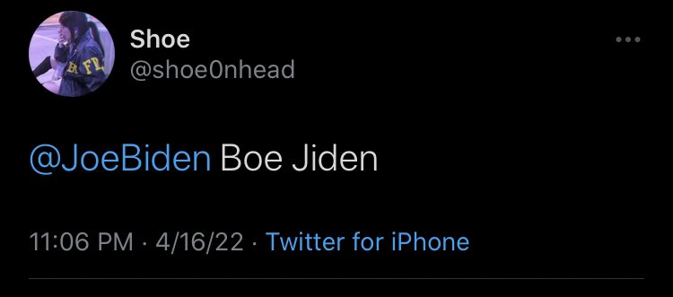

```{r setup, include=FALSE}
options(htmltools.dir.version = FALSE)
```

```{r xaringan-themer, include=FALSE}
library(xaringanthemer)
library(xaringanExtra)
use_panelset()


style_duo_accent(
  footnote_color = "#2c8475",
  footnote_position_bottom = "20px",
  footnote_font_size = "0.5em",
  primary_color = "#28282B",
  #primary_color = "#960606",
  secondary_color = "#2c8475",
  black_color = "#4242424",
  white_color = "#FFF",
  base_font_size = "25px",
  # text_font_family = "Jost",
  # text_font_url = "https://indestructibletype.com/fonts/Jost.css",
  header_font_google = google_font("Libre Franklin", "200", "400"),
  header_font_weight = "200",
    header_background_color = "#2c8475",
    header_background_text_color = "#2c8475",

  inverse_header_color = "#eaeaea",
  title_slide_text_color = "#FFFFFF",
  text_slide_number_color = "#9a9a9a",
  text_bold_color = "black",
  code_inline_color = "#B56B6F",
  code_highlight_color = "transparent",
  link_color = "#2c8475",
  table_row_even_background_color = lighten_color("#345865", 0.9),
  extra_fonts = list(
    "https://indestructibletype.com/fonts/Jost.css",
    google_font("Amatic SC", "400")
  ),
  colors = c(
    green = "#31b09e",
    "green-dark" = "#2c8475",
    highlight = "#87f9bb",
    purple = "#887ba3",
    pink = "#B56B6F",
    orange = "#f79334",
    red = "#dc322f",
    `blue-dark` = "#002b36",
    `text-dark` = "#202020",
    `text-darkish` = "#424242",
    `text-mild` = "#606060",
    `text-light` = "#9a9a9a",
    `text-lightest` = "#eaeaea"
  ),
  extra_css = list(
    ".remark-slide-content h3" = list(
      "margin-bottom" = 0, 
      "margin-top" = 0
    ),
    ".smallish, .smallish .remark-code-line" = list(`font-size` = "0.7em")
  )
)
xaringanExtra::use_xaringan_extra(c("tile_view", "animate_css", "tachyons", "share_again"))
xaringanExtra::use_extra_styles()

```

```{r metadata, echo=FALSE}
library(metathis)
meta() %>% 
  meta_description("InteRculturales, Pontificia Universidad Católica de Chile, Enero 10, 2025") %>% 
  meta_social(
    title = "InteRculturales",
    url = "",
    image = "",
    twitter_card_type = "summary_large_image",
    twitter_creator = "matdknu"
  )
```


```{r components, include=FALSE}
slides_from_images <- function(
  path,
  regexp = NULL,
  class = "hide-count",
  background_size = "contain",
  background_position = "top left"
) {
  if (isTRUE(getOption("slide_image_placeholder", FALSE))) {
    return(glue::glue("Slides to be generated from [{path}]({path})"))
  }
  if (fs::is_dir(path)) {
    imgs <- fs::dir_ls(path, regexp = regexp, type = "file", recurse = FALSE)
  } else if (all(fs::is_file(path) && fs::file_exists(path))) {
    imgs <- path
  } else {
    stop("path must be a directory or a vector of images")
  }
  imgs <- fs::path_rel(imgs, ".")
  breaks <- rep("\n---\n", length(imgs))
  breaks[length(breaks)] <- ""

  txt <- glue::glue("
  class: {class}
  background-image: url('{imgs}')
  background-size: {background_size}
  background-position: {background_position}
  {breaks}
  ")

  paste(txt, sep = "", collapse = "")
}
options("slide_image_placeholder" = FALSE)
```

class: left title-slide
background-image: url('img/text-mining.jpeg')
background-size: cover
background-position: left


[matdknu]: https://twitter.com/matdknu
[github]: https://matdknu.github.io


.side-text[
[&commat;matdknu][matdknu] | [matdknu.github.io][github]
]

.title-where[
### **InteRculturales <br> Introducción a técnicas de <br> ciencias sociales computacionales **
Centro de Estudios Interculturales e Indígenas <br>
Sesión 5: Introducción al análisis de texto
]

```{css echo=FALSE}
.title-slide h1 {
  font-size: 80px;
  font-family: Jost, sans;
  color: #960606;  /* Cambio del color del texto a morado */
   position: absolute;
  top: 150px; /* Ajusta este valor para mover verticalmente */
  left: 50px; /* Ajusta este valor para mover horizontalmente */
}

.side-text {
  color: #960606;  /* Cambio del color del texto lateral a morado */
  transform: rotate(90deg);
  position: absolute;
  font-size: 22px;
  top: 150px;
  right: -130px;
}

.side-text a {
  color: #960606;  /* Cambio del color de los enlaces a morado */
}

.title-where {
  font-family: Jost, sans;
  font-size: 25px;
  position: absolute;
  bottom: 10px;
  color: #960606;  /* Cambio del color del texto de ubicación a morado */
}

/******************
 * 
 * Coloured content boxes
 *
 ****************/


.content-box { 
    box-sizing: content-box;
    	background-color: #e2e2e2;
  /* Total width: 160px + (2 * 20px) + (2 * 8px) = 216px
     Total height: 80px + (2 * 20px) + (2 * 8px) = 136px
     Content box width: 160px
     Content box height: 80px */
}

.content-box-primary,
.content-box-secondary,
.content-box-blue,
.content-box-gray,
.content-box-grey,
.content-box-army,
.content-box-green,
.content-box-purple,
.content-box-red,
.content-box-yellow {
    /*border-radius: 15px; */
    margin: 0 0 25px;
    overflow: hidden;
    padding: 20px;
    width: 100%;
}


.content-box-primary {
	background-color: var(--primary);

}


.content-box-secondary {
	background-color: var(--secondary);

}

.content-box-blue {
    background-color: #F0F8FF;

}

.content-box-gray {
    background-color: #e2e2e2;
}

.content-box-grey {
	background-color: #F5F5F5;
}

.content-box-army {
	background-color: #737a36;
}

.content-box-green {
	background-color: #d9edc2;
}

.content-box-purple {
	background-color: #e2e2f9;
}

.content-box-red {
	background-color: #f9dbdb;
}

.content-box-yellow {
	background-color: #fef5c4;
}


.full-width {
    display: flex;
    width: 100%;
    flex: 1 1 auto;
}

```


```{r logo, echo=FALSE}
library(xaringanExtra)
use_logo(
  image_url = "logo_ciir.jpg",
  exclude_class = c("title-slide","hide_logo","inverse"),
  width = "150px",
  height = "150px")
```

---
# Introducción 


---

class: left middle

.full-width[.content-box-purple[
.bolder[]
Pues bien; si a un cervantista se le ocurriera decir: el Quijote empieza con dos palabras
monosilábicas terminadas en n: (en y un), y sigue con una de cinco letras (lugar), con dos de dos
letras (de la), con una de cinco o de seis (Mancha), y luego se le ocurriera derivar conclusiones de
eso, inmediatamente se pensaría que está loco. La Biblia ha sido estudiada de ese modo.

Jorge Luis Borges en "La Cábala". Conferencias denominadas Siete Noches

]]


---
### ¿Y lo podremos hacer?

<p style="font-size: 24px;">
<span style="color: red;">En</span> 
<span style="color: blue;">un</span> 
<span style="color: black;">lugar</span> 
<span style="color: green;">de</span> 
<span style="color: purple;">la</span> 
<span style="color: black;">Mancha,</span> 
<span style="color: red;">de</span> 
<span style="color: black;">cuyo</span> 
<span style="color: black;">nombre</span> 
<span style="color: blue;">no</span> 
<span style="color: black;">quiero</span> 
<span style="color: brown;">acordarme</span>.
</p>

--

<p style="font-size: 18px;">
<span style="color: red;">(1)</span> 
<span style="color: blue;">(1)</span> 
<span style="color: black;">(2)</span> 
<span style="color: green;">(1)</span> 
<span style="color: purple;">(1)</span> 
<span style="color: black;">(2)</span> 
<span style="color: red;">(1)</span> 
<span style="color: brown;">(2)</span> 
<span style="color: black;">(2)</span> 
<span style="color: blue;">(1)</span> 
<span style="color: black;">(2)</span> 
<span style="color: brown;">(4)</span>
</p>

--

<div style="display: flex; align-items: center;">

<div style="flex: 1; padding-right: 20px;">

<table style="width:100%; border-collapse: collapse;">
<thead>
<tr>
<th style="text-align: left;">Palabra</th>
<th style="text-align: left;">Tipo</th>
</tr>
</thead>
<tbody>
<tr>
<td>En</td>
<td>Preposición</td>
</tr>
<tr>
<td>un</td>
<td>Artículo</td>
</tr>
<tr>
<td>lugar</td>
<td>Sustantivo</td>
</tr>
<tr>
<td>de</td>
<td>Preposición</td>
</tr>
<tr>
<td>la</td>
<td>Artículo</td>
</tr>
<tr>
<td>Mancha</td>
<td>Sustantivo propio</td>
</tr>
</tbody>
</table>

</div>

<div style="flex: 1;">

```{r, echo=FALSE, message=FALSE, warning=FALSE}

# Crear la secuencia
secuencia <- c(1, 1, 2, 1, 1, 2, 1, 2, 2, 1, 2, 4)

# Crear un gráfico de líneas
plot(secuencia, type = "o", pch = 16, lwd = 2,
     xlab = "Posición en la secuencia", ylab = "Valor",
     main = "Gráfico de la secuencia (1)(1)(2)(1)(1)(2)...")

# Agregar líneas de referencia
abline(h = unique(secuencia), col = "gray", lty = 3)

```

---

### Sabemos que denotan y connotan

```{r, echo=FALSE, message=FALSE, warning=FALSE}
library(magick)

img <- image_read("img/guerra-pinera.jpg")

img

```

---

<div style="display: flex; justify-content: center; align-items: center;">

<div style="flex: 1; text-align: center;">

</div>

<div style="flex: 1; text-align: center;">

</div>

</div>

---

### Los datos textuales son miles de millones


```{r, echo=FALSE, message=FALSE, warning=FALSE}
library(magick)

img <- image_read("img/polarization.png")

img

```

---

# ¿Por qué analizar texto?

- **Volumen masivo** de datos textuales: redes sociales, artículos, emails.
- **Toma de decisiones** basada en datos narrativos.
- **Automatización** de tareas antes manuales.

---

# Desarrollo Reciente

- NLP moderno impulsa el análisis de texto:
  - Modelos estadísticos ➔ modelos neuronales.
  - De análisis de palabras aisladas ➔ análisis de contexto completo.
- Avances clave: **Word Embeddings**, **Transformers**, **Large Language Models**.

---

# Principales Técnicas

- Preprocesamiento: Tokenización, Stopwords, Lematización.
- Representación: Bolsa de Palabras, TF-IDF, Embeddings.
- Análisis: Sentimientos, Clasificación, Modelado de Temas.

---

# Tokenización

## ¿Qué es?

> **Dividir el texto en unidades más pequeñas ("tokens")** como palabras, frases o caracteres.

---

# Tokenización

## Ejemplo

**Texto original:**  
*"En un lugar de la Mancha."*

**Tokens:**
- En
- un
- lugar
- de
- la
- Mancha

---

# Tokenización

## Esquema visual

```
Texto → [ "En", "un", "lugar", "de", "la", "Mancha" ]
```

---

# Eliminación de Stopwords

## ¿Qué son?

> **Palabras comunes** que suelen aportar poco significado en el análisis (ej: "el", "de", "y").

---

# Eliminación de Stopwords

## Ejemplo

**Texto tokenizado:**  
["En", "un", "lugar", "de", "la", "Mancha"]

**Después de eliminar stopwords:**  
["lugar", "Mancha"]

---

# Eliminación de Stopwords

## Esquema visual

```
["En", "un", "lugar", "de", "la", "Mancha"]
↓ Eliminar ["En", "un", "de", "la"]
["lugar", "Mancha"]
```

---

# Lematización

## ¿Qué es?

> **Reducir las palabras a su forma base o "lema".**  
> Ejemplo: "corriendo" ➔ "correr".

---

# Lematización

## Ejemplo

| Palabra original | Lema    |
|:-----------------|:--------|
| jugando          | jugar   |
| casas            | casa    |
| mejores          | mejor   |

---

# Lematización

## Esquema visual

```
Texto: "Las niñas corriendo en los parques."
↓
Lemas: ["niña", "correr", "parque"]
```

---

# Representación de Texto: Bag of Words

## ¿Qué es?

> Modelo que representa texto según la frecuencia de palabras, ignorando el orden.

---

# Representación de Texto: Bag of Words

<div style="display: flex; align-items: flex-start;">

<!-- Texto a la izquierda -->
<div style="flex: 1; padding-right: 30px;">

<ul>
  <li><strong>Persona 1:</strong> "Estallido social."</li>
  <li><strong>Persona 2:</strong> "Estallido delictual."</li>
  <li><strong>Persona 3:</strong> "Estallido popular."</li>
  <li><strong>Persona 4:</strong> "Revuelta popular."</li>
</ul>

</div>

<!-- Tabla BoW a la derecha -->
<div style="flex: 1;">

<table style="width:100%; border-collapse: collapse;">
  <thead>
    <tr>
      <th style="text-align: left;">Palabra</th>
      <th style="text-align: center;">Persona 1</th>
      <th style="text-align: center;">Persona 2</th>
      <th style="text-align: center;">Persona 3</th>
      <th style="text-align: center;">Persona 4</th>
    </tr>
  </thead>
  <tbody>
    <tr>
      <td>estallido</td>
      <td style="text-align: center;">1</td>
      <td style="text-align: center;">1</td>
      <td style="text-align: center;">1</td>
      <td style="text-align: center;">0</td>
    </tr>
    <tr>
      <td>social</td>
      <td style="text-align: center;">1</td>
      <td style="text-align: center;">0</td>
      <td style="text-align: center;">0</td>
      <td style="text-align: center;">0</td>
    </tr>
    <tr>
      <td>delictual</td>
      <td style="text-align: center;">0</td>
      <td style="text-align: center;">1</td>
      <td style="text-align: center;">0</td>
      <td style="text-align: center;">0</td>
    </tr>
    <tr>
      <td>popular</td>
      <td style="text-align: center;">0</td>
      <td style="text-align: center;">0</td>
      <td style="text-align: center;">1</td>
      <td style="text-align: center;">1</td>
    </tr>
    <tr>
      <td>revuelta</td>
      <td style="text-align: center;">0</td>
      <td style="text-align: center;">0</td>
      <td style="text-align: center;">0</td>
      <td style="text-align: center;">1</td>
    </tr>
  </tbody>
</table>

</div>

</div>

---


```{r, echo=FALSE, message=FALSE, warning=FALSE}

# Cargar paquete
library(igraph)

# Definir las conexiones (aristas) entre palabras
relaciones <- data.frame(
  from = c("estallido", "estallido", "estallido", "revuelta"),
  to   = c("social", "delictual", "popular", "popular")
)

# Crear grafo
g <- graph_from_data_frame(relaciones, directed = FALSE)

# Dibujar red
plot(
  g,
  vertex.label.color = "black",
  vertex.label.cex = 1.2,
  vertex.color = "lightblue",
  edge.color = "gray50",
  edge.width = 2,
  layout = layout_with_fr,
  main = "Red semántica de términos usados"
)

```


---

# Representación de Texto: TF-IDF

## ¿Qué es?

> Medida que pondera la importancia de una palabra en un documento, considerando su frecuencia en el corpus.

---

# Representación de Texto: TF-IDF

## Idea Clave

- Palabras frecuentes en un documento pero raras en el corpus son más importantes.
- Palabras muy comunes en todos los documentos pierden peso.

---

# Representación de Texto: Word Embeddings

## ¿Qué son?

> Representaciones vectoriales densas donde palabras similares tienen representaciones similares.

Ejemplo:  
- "rey" - "hombre" + "mujer" ≈ "reina"

---

# Representación de Texto: Word Embeddings

## Esquema visual

```
"rey" → [0.25, 0.78, -0.33, ...]
"reina" → [0.26, 0.79, -0.31, ...]
```

---

# Análisis de Sentimientos

## ¿Qué es?

> Determinar la actitud o emoción expresada en un texto (positivo, negativo, neutro).

---

# Clasificación de Textos

## ¿Qué es?

> Asignar una etiqueta a un texto: tema, categoría, intención, etc.

Ejemplos:
- Spam vs. No Spam
- Noticias: Política, Deportes, Tecnología

---

# Modelado de Temas

## ¿Qué es?

> Descubrir automáticamente temas recurrentes en grandes colecciones de texto.

Ejemplo:  
- Noticias ➔ temas de política, salud, deportes.

---

# Ventajas del Análisis de Texto

- Procesa datos masivos rápidamente.
- Identifica patrones ocultos.
- Permite análisis predictivos.
- Automatiza tareas complejas.

---

# Desventajas del Análisis de Texto

- Ambigüedad y polisemia.
- Dificultades de contextualización.
- Dependencia de calidad de datos.
- Riesgo de reproducir sesgos existentes.

---

# Conclusión

- El análisis de texto es clave en la sociedad de la información.
- Requiere combinar técnica, interpretación y ética.
- Sus aplicaciones seguirán creciendo con la IA.


---

class: middle right
background-image: url('d-koi-GQJY4UPR21U-unsplash.jpg')
background-size: cover

# **Muchas Gracias**
### **Vamos al código!**